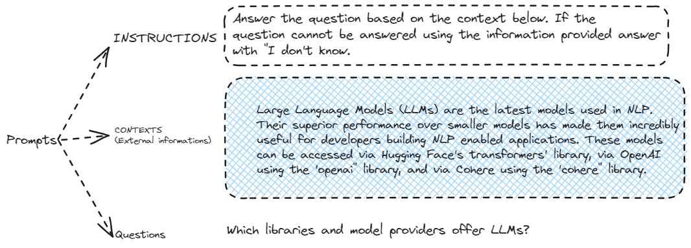
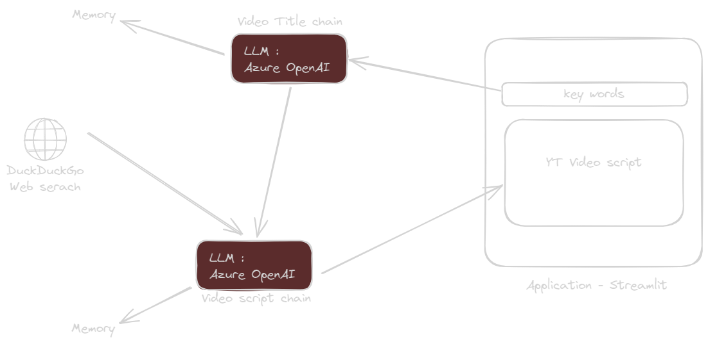

# Création d'une application

## Prompt definition

Langchain va permettre de mieux structurer les prompts.



## création d'une App de génération de scripts de vidéos
### Architecture

on se propose de créer une application streamlit simple, qui prendra en entrée des mots clés et donnera en sortie le script d'une vidéo courte.




### Outils

Ci-dessous les outils utilisés :

* `python` comme langage de programmation
* `langchain` : pour l'intégration des différents outils
* `DuckDuckGo` pour réaliser des recherches sur internet
* `LangSmith` pour le monitoring
* `Docker` pour simplifier le déploiement

### Lancement

Lancement avec les commandes ci-dessous : (utiliser l'option 1 ou 2 et non les 2)

```sh
# OPTION 1 :
# build the image
docker build -t script_app -f ./Dockerfile .

# run the image
docker run -p 8501:8501 --env-file ../.env --rm script_app

# OPTION 2 :
# run with docker compose
docker compose up --build
```